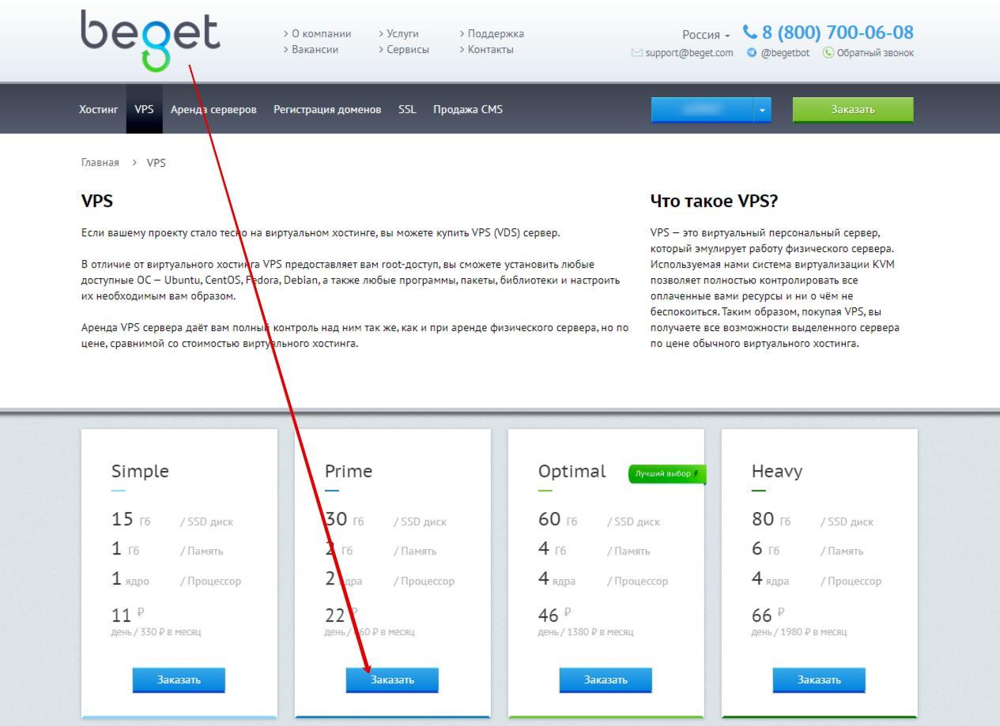
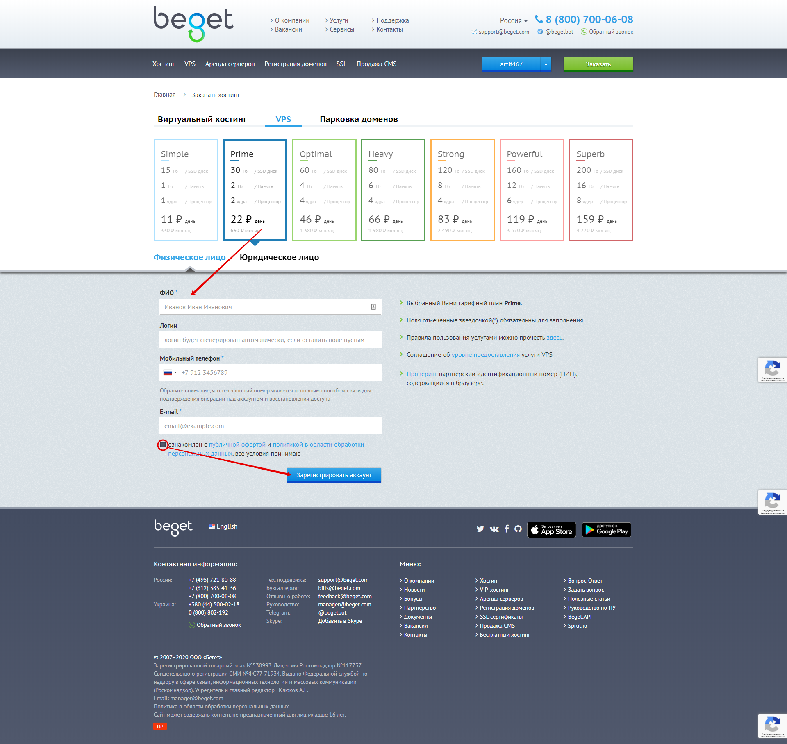
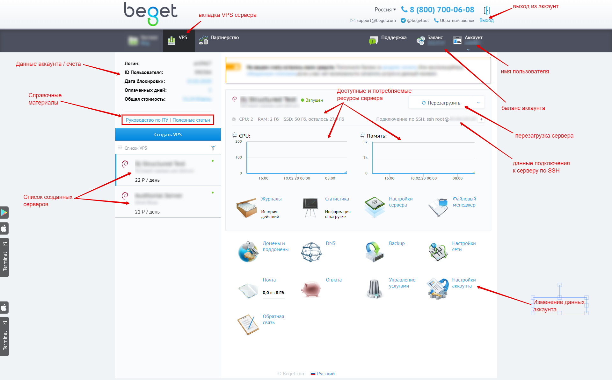
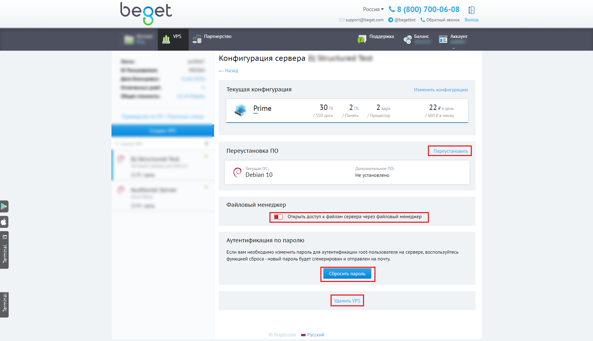

# Создание Beget VPS

Beget является выбранной в данном случае компанией-поставщиком услуг виртуального выделенного сервера \(VPS\). Необходимо иметь зарегистрированный аккаунт, для чего переходим по адресу [https://beget.com/ru/vps](https://beget.com/ru/vps) и выбираем подходящий тариф, затем нажимаем "Заказать".

Далее необходимо будет ввести учетные данные, указать согласие с правилами сервиса и нажать кнопку "Зарегистрировать аккаунт". Затем во всплывающем окне необходимо будет подтвердить номер телефона: будет выслан одноразовый код подтверждения на указанный номер, который необходимо ввести в определенное поле на сайте. На указанный адрес электронной почты в скором времени \(как правило, в течение 1 часа\) поступит сообщение с данными для входа в аккаунт и NS-записями для перенаправления домена.

После получения сообщения на указанный в форме регистрации Email можно зайти в панель управления выделенным сервером по ссылке [https://cp.beget.com](https://cp.beget.com/vps) 

Оплату можно производить в разделе "Оплата" посредством зачисления произвольной суммы, а дата блокировки аккаунта будет указана на главной странице в панели управления.

В разделе "Настройки сервера" можно отключить доступ к файлам через файловый менеджер, переустановить VPS \(вернуть в начальное состояние, удалив все данные и оставив только чистую операционную систему\), сбросить пароль \(если используется доступ по паролю\) или полностью удалить VPS. 

После того, как был создан виртуальный сервер VPS и мы получили данные для подключения по SSH можно получить удаленный доступ на сервер и произвести его первичную настройку. 

