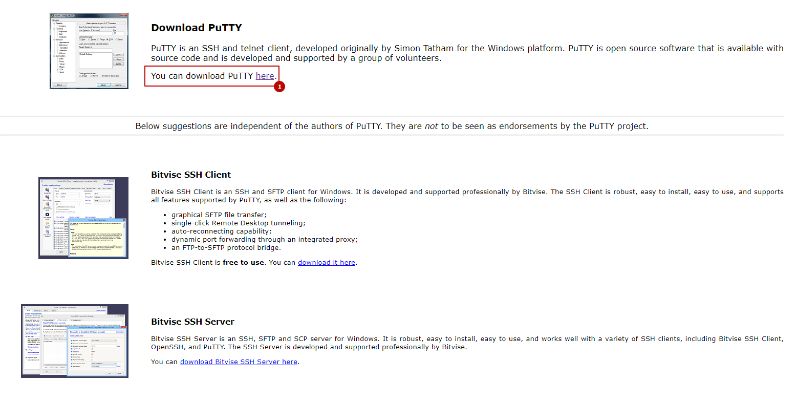
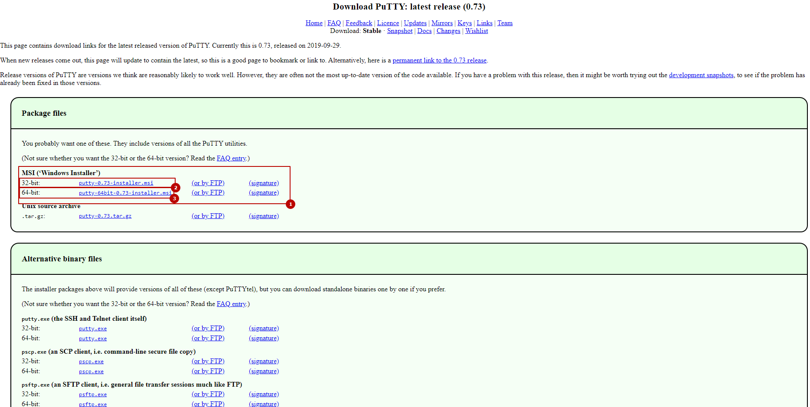
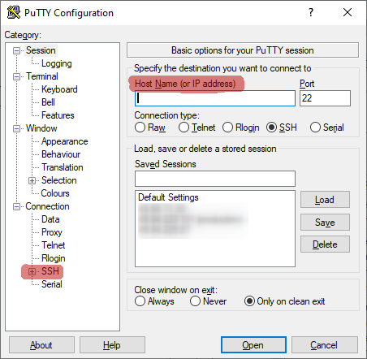
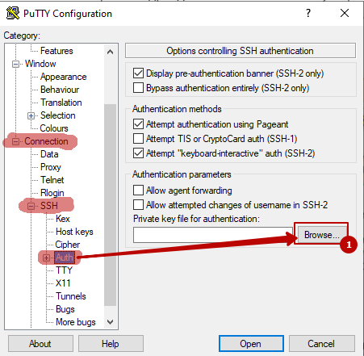
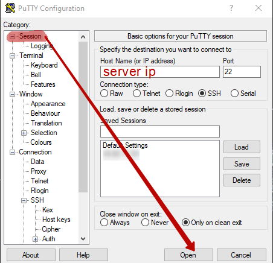
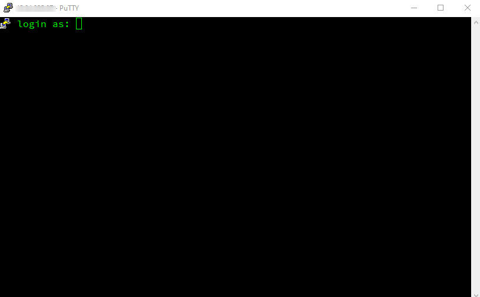
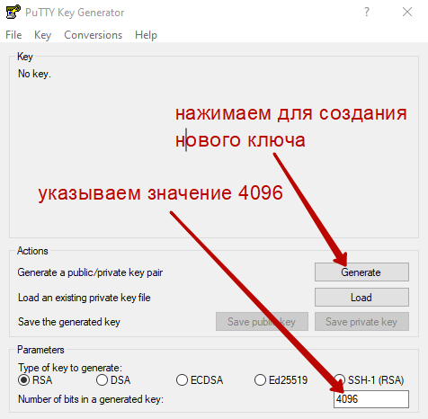
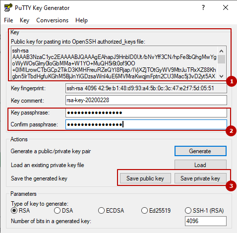
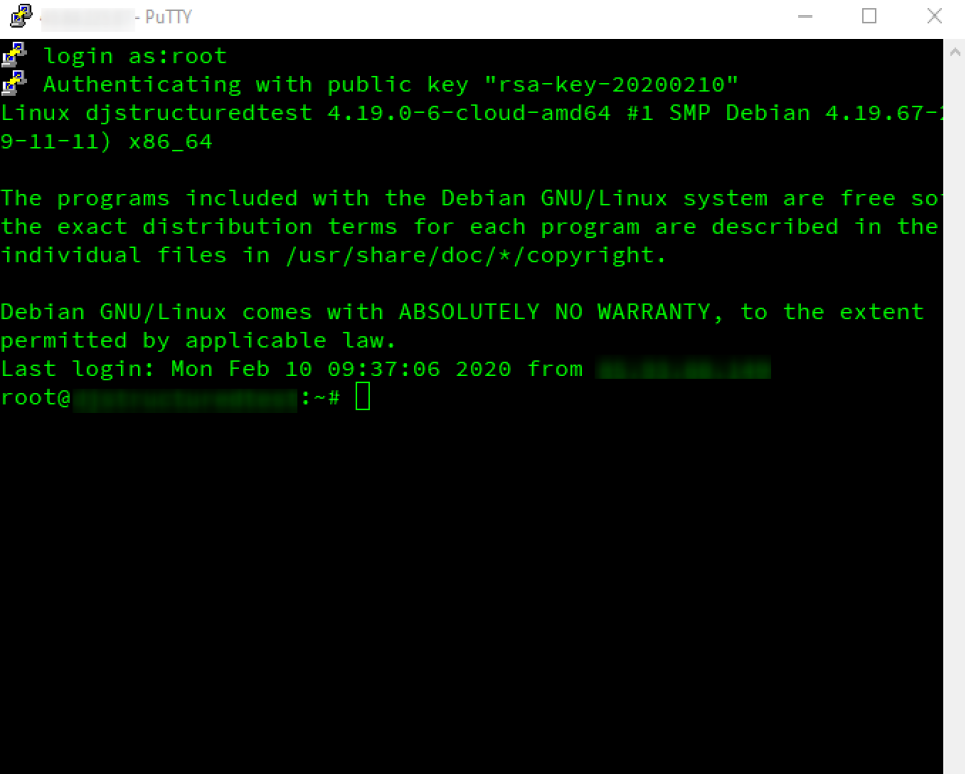
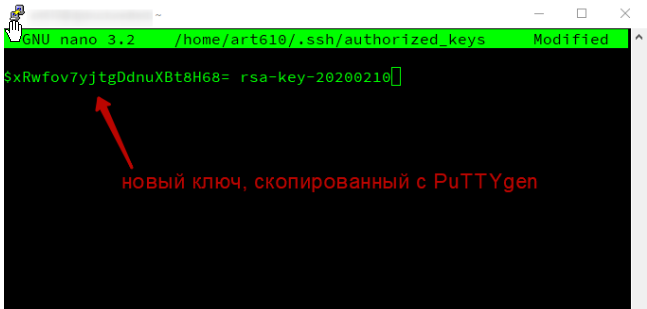

# SSH доступ к серверу

## Скачивание и установка SSH-клиента

Для доступа по SSH из-под операционной системы Windows используем утилиту PuTTY, которую можно бесплатно получить на официальном сайте разработчика по ссылке [https://www.putty.org/](https://www.putty.org/).



На главной странице нажимаем на ссылку "here" \(1\). На следующей странице скачиваем установочный файл в соответствии с разрядностью операционной системы: 1 - ссылки на установочные файлы; 2 и 3 - разрядность операционной системы.



После скачивания запускаем установочный файл и производим стандартную установку. 

> Пользователи Linux могут производить доступ к удаленному серверу при помощи командной строки и команды вида ssh username@host-ip

После установки PuTTY на Windows в меню "Пуск -&gt; Все приложения" станут доступны утилиты **PuTTY** и **PuTTYgen** в общей папке с названием PuTTY.

## Доступ к серверу при помощи ключа SSH

Если у нас уже есть ключ SSH, то для доступа к серверу можно использовать ранее установленную утилиту PuTTY. В поле "Host Name \(or IP address\)" необходимо ввести IP-адрес сервера, к которому осуществляется подключение. В панели слева раскрыть подменю "SSH" нажав на "плюсик" слева от названия раздела. 



Далее в панели слева выбираем подраздел "Auth". В соответствующей панели справа нажимаем кнопку "Browse..." и посредством проводника Windows указываем путь к файлу приватного ключа SSH.



После указания пути к SSH-ключу, возвращаемся в первый раздел "Session" и нажимаем кнопку "Open".



Открывается командная строка с приглашением к вводу имени пользователя. 



Теперь вводим соответствующее имя пользователя и при необходимости парольную фразу для ключа SSH. Таким образом мы получаем доступ к серверу по SSH через утилиту-клиент PuTTY на Windows. 

## Добавление нового пользователя с доступом по SSH

Создадим нового системного пользователя Debian и добавим для него SSH-ключ для возможности удаленного доступа к серверу. Необходимо подключиться к удаленному серверу при помощи утилиты PuTTY и root-пользователя \(как описано в предыдущем разделе\). Затем необходимо выполнить следующие команды в командной строке утилиты PuTTY:

```text
# создаем системного пользователя Debian
# <username> заменяем на любое имя пользователя, например, user
# в ходе диалога указываем пароль и учетные данные
# подтверждаем создание нового пользователя, нажав клавишу Y и Enter
sudo adduser <username>

# добавляем пользователя в группу sudo
sudo usermod -aG sudo <username>

# проверим наличие созданного пользователя
id <username>
# перезаходим за созданного пользователя
su - <username>
# повышаем привелегии пользователя до root
sudo su
# выходим из-под root
exit
# выходим из-под созданного пользователя
```

### Создаем SSH-ключ для нового пользователя

Для этого используем утилиту **PuTTYgen**, которая была установлена ранее в одном пакете вместе с утилитой **PuTTY**. Соответственно, открываем её на Windows через "Пуск -&gt; Все приложения -&gt; PuTTY -&gt; PuTTYgen" .



Указываем длину ключа 4096 бит, как указано на изображении выше, и нажимаем кнопку "Generate". При генерации ключа необходимо будет передвигать курсор в пустой серой области окна утилиты PuTTYgen. 



После генерации нового ключа SSH в утилите PuTTYgen появится общая информация и возможность сохранить данный ключ. Публичный ключ будет выведен в поле \(1\). При необходимости усиленной защиты в \(2\) можно указать парольную фразу \(какое-либо предложение или слово латиницей без пробелов\), ввести её необходимо два раза в поля "Key passphrase" и "Confirm passphrase". 

Затем можно сохранить публичный и приватный ключи нажатием кнопок "Save public key" и "Save private key" \(3\), соответственно, и указанием папки для сохранения посредством проводника \(данные ключи позволяют получить удаленный доступ к серверу, поэтому стоит их хранить отдельно от файлов с публичным доступом\). 

Программу **не закрываем** потому, как значение в верхнем поле Key \(начинается с ssh-rsa\) потребуется скопировать на сервер в файл authorized\_keys \(можно его скопировать пока что в отдельный текстовый файл и сохранить, а утилиту закрыть\). Необходимо скопировать значение вида \(обратите внимание на область прокрутки справа\):

```text
ssh-rsa AAAAB3NzaC1yc2EAAAABJQAAAgEAzB9Rm...XPxNZLo8H68= rsa-key-20200210
```

Значение должно начинаться на "ssh-rsa.." и оканчиваться на "..rsa-key-xxxxxxx", где xxxxxxx представляет собой некоторое число.

В итоге мы имеем публичный и приватный ключи для доступа к удаленному серверу через PuTTY и публичный ключ для вставки в файл authorized\_key на сервере \(конвертировать в ключи для OpenSSH можно также в утилите PuTTYgen во вкладке "Conversions"\). 

### Добавляем публичный ключ на удаленный сервер

Далее необходимо зайти на удаленный сервер посредством PuTTY и пользователя, который уже имеет доступ по SSH \(изначально это root-пользователь\). Открываем утилиту PuTTY, вводим ip-адрес сервера, указываем путь к SSH-ключу пользователя, под которым хотим зайти, как было описано ранее. И нажимаем кнопку "Open". Открывается командная строка утилиты PuTTY с предложением ввести имя пользователя. Вводим имя пользователя, под которым хотим зайти, при необходимости также вводим парольную фразу и заходим на удаленный сервер. В итоге командная строка будет иметь вид как на изображении ниже \(не учитывая оформление\).



Далее выполняем ряд команд, чтобы открыть файл authorized\_key на удаленном сервере:

```text
# перезаходим за нового пользователя (при необходимости вводим пароль)
su - <username>
# создаем директорию .ssh
sudo mkdir ~/.ssh
# открываем в редакторе nano файл authorized_keys 
sudo nano ~/.ssh/authorized_keys
```


Переводим курсор на пустую строку ниже. На своем компьютере Windows копируем ранее созданный ключ из текстового файла или из области Key утилиты PuTTYgen. 


Затем наводим курсор мыши на открытое окно командной строки PuTTY, делаем окно активным щелчком левой кнопкой мыши и, далее, копируем ключ правым щелчком мыши на области командной строки.



Далее сохраняем изменения посредством нажатия комбинации клавиш "Ctr+X" и далее клавиши Y \(не забываем указать английскую раскладку клавиатуры\) и Enter. В итоге мы добавили новый SSH ключ на удаленный сервер. 

Устанавливаем требуемые права на директорию `/home/<username>/.ssh` посредством следующих команд:

```text
sudo chmod 700 ~/.ssh/
sudo chmod 600 ~/.ssh/authorized_keys
sudo chown -R <username>:<username> ~/.ssh/
```

Теперь можно закрыть утилиту PuTTY и затем попробовать зайти под новым пользователем с новым ключом SSH \(также открываем утилиту PuTTY, указываем ip-адрес сервера и указываем путь к новому SSH-ключу, далее нажимаем Open и вводим новое имя пользователя &lt;username&gt; в командную строку\) .

### Настройка ограничений на доступ к серверу

В целях безопасности необходимо исключить удаленный доступ от root-пользователя, а также доступ пользователей по паролям. В итоге оставить только доступ для обычных пользователей при помощи ключей SSH, а для выполнения операций из-под root использовать утилиту sudo на Linux Debian. 

> Необходимо быть уверенным, что есть возможность доступа при помощи любого **системного** пользователя Debian \(не root-пользователя\) и **соответствующего SSH-ключа** для данного пользователя, иначе в итоге данных операций получить доступ на сервер будет невозможно!

Заходим на удаленный сервер при помощи утилиты PuTTY под системным пользователем \(не root\). Выполняем следующие команды:

```text
# открываем в редакторе nano конфигурацию ssh (вводим пароль пользователя)
sudo nano /etc/ssh/sshd_config

# в файле нужно установить (расскомментировать) следующие значения
    LoginGraceTime 30    # на вход в систему выделяется 30 секунд
    PermitRootLogin no    # запрет удаленного доступа из-под root
    MaxAuthTries 3    # максимальное количество неудачных попыток входа
    Protocol 2     # ограничение на использование более слабых протоколов
    PubkeyAuthentication yes    # аутентификация по публичному ключу SSH
    # использование списка ключей из authorized_keys
    AuthorizedKeysFile      .ssh/authorized_keys .ssh/authorized_keys2
    HostbasedAuthentication no    # доступ с хоста без пароля
    PasswordAuthentication no    # аутентификация по паролям
    PermitEmptyPasswords no    # допустимость пустых паролей
    UsePAM yes    # использование API Pluggable Authentication Modules
    # в конце файла удалить повтор PasswordAuthentication yes

# выходим из файла Ctrl+X с сохранением - Y + Enter
# затем перезапускаем службу ssh 
sudo service sshd restart
```

Теперь удаленный вход доступен только для системных пользователей по ключам SSH. Ограничено время на выполнение входа и максимальное количество неудачных попыток входа. 

Для того, чтобы заблокировать доступ отдельному пользователю необходимо удалить его SSH ключ из соответствующего файла `/home/<username>/.ssh/authorized_keys` \(редактирование данного файла было описано выше\) и затем, при необходимости, можно также удалить аккаунт данного пользователя следующей командой:

```text
sudo killall -u <username>    # завершить все процессы пользователя
userdel -r <username>    # удалить учетную запись пользователя
```

Для дополнительной защиты от брутфорса можно воспользоваться утилитой [fail2ban](http://www.fail2ban.org/wiki/index.php/Main_Page). Дополнительно настроить порты и т.п. Более подробно про повышение безопасности сервера при доступе к нему по SSH можно прочитать, например, по ссылке: [https://www.ibm.com/developerworks/ru/library/au-sshlocks/index.html](https://www.ibm.com/developerworks/ru/library/au-sshlocks/index.html)

